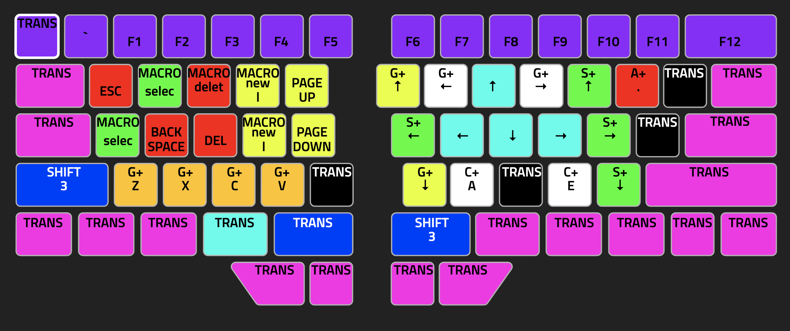
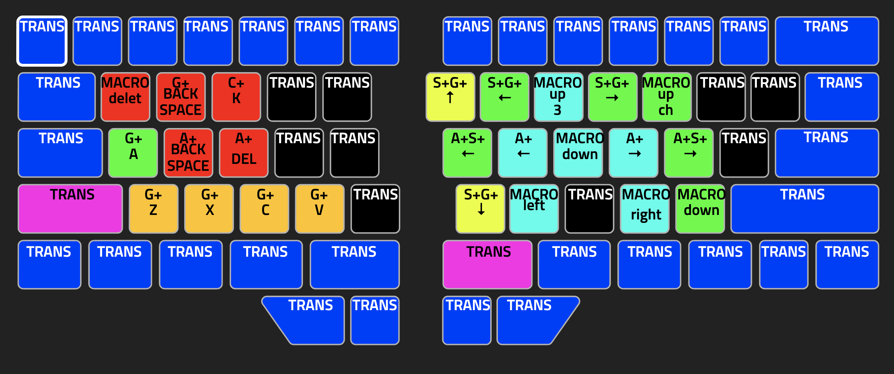

# Dygma Layer

I am using mac, and running version V1.0.0 beta10

This is a similar layout that I have ported over from past keyboard configurations. To help explain what is going on, I created a youtube video.

### Navigating and editing layer
  

### Hyper navigating and editing layer

