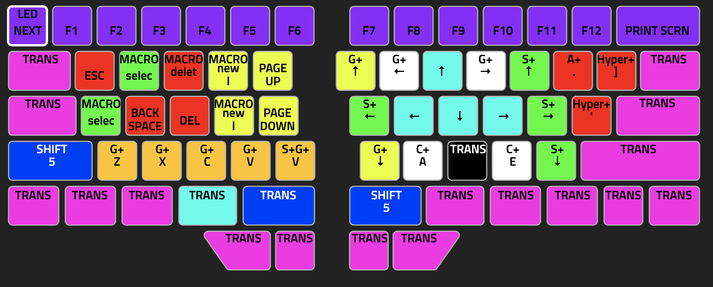
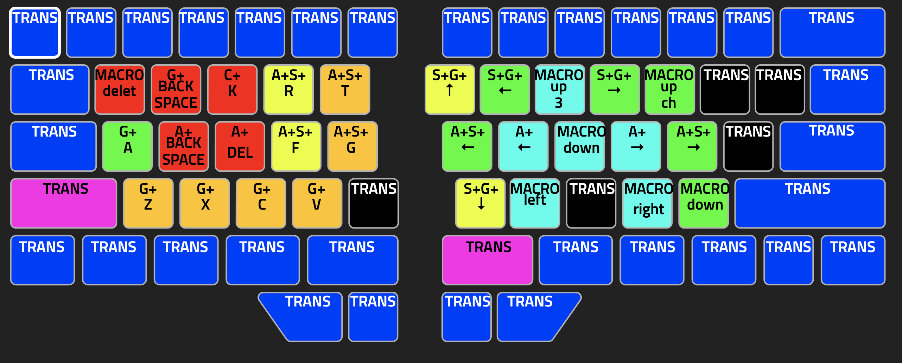
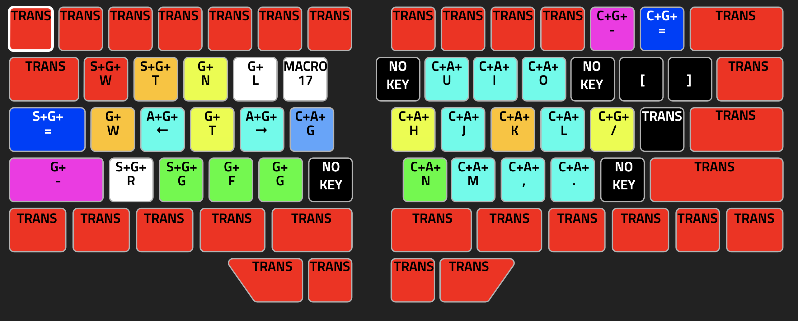
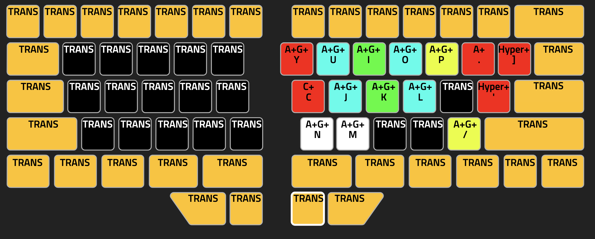
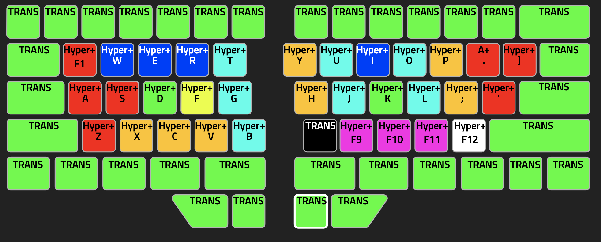

# Dygma Layer

I am using mac, and running version V1.0.0 beta10

This is a similar layout that I have ported over from past keyboard configurations. To help explain what is going on, I created a youtube video.

## Navigating/Editing Layers

In general, navigation and selecting text macros are on the right half. Editing by deleting or selecting macros is on the left.

### Navigating and editing layer
  

### Hyper navigating and editing layer

## Screen(spectacle) and Chrome manipulation layer

Update: The sides have been swapped. This is because the find in chrome is very similar command to a find in vs code and I wanted them to be in the same position.

The ~~left~~ **Right** side of the keyboard contains screen manipulation macros. The ~~right~~**Left** side of the keyboard contains Chrome manipulating macros.

## VS Code Editor and Terminal Layer

